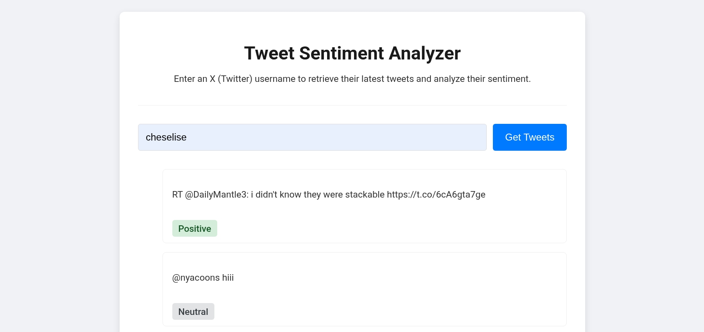

<div align="center">
<h1>🐦 Twitter Sentiment Analysis </h1>

Complete source code for the Twitter Sentiment Analysis course project (Group 7, Topic 12) for the course CS F320.

Includes an API, and a simple front-end for live classification of any user's tweets using our most performant model.

</div>

---

The jupyter notebook `Project_G7_T12.ipynb` contains the relevant code snippets, and EDA used while developing the model.

If you wish to run the inference yourself, copy the folders in the `datasets` folder onto your notebook's runtime. All cells will execute succesfully in an estimated time of 45 minutes.


# API Usage instructions

First clone the repository:

```bash
git clone git@github.com:cross-codes/Sentiment-API.git
```

Next, create a virtual environment:

Install `virtualenv` using pip globally

```bash
pip install virtualenv
```

and then create a virtual environment in the cloned directory

```bash
virtualenv venv
```

To activate, run the corresponding script for your shell (e.g `overlay use ...` for nu)

Afterwards, install all necessary packages using pip:

```bash
pip install -r requirements.txt
```

---

To launch the API, ensure that you have a valid X (Twitter) API bearer token. This can be stored in your device's environment, the venv, or you can export `X_BEARER_TOKEN` in your shell's instance to launch the API using `fastapi dev`.

For example, with the third method of directly exporting the key, you'd run:

```bash
X_BEARER_TOKEN=YOUR_BEARER_TOKEN_HERE fastapi dev
```

on a POSIX compliant shell like `bash` or `zsh`

This exposes the API on [`localhost:8000`](http://localhost:8000/). You may test the API manually using `cURL`; the only exposed endpoints are `GET` `/api/tweets/{username}` and `POST` `/classification`.

Alternatively you may use the simple front-end included in this repository for a more interactive UI.

Change the directory to `front`

```bash
cd front
```

and launch a simple HTTP server to host the HTML file (cf.eg:)

```bash
python -m http.server 8080
```

The web-service would be accessible on [`localhost:8080`](http://localhost:8080/). The web-service looks like this



Pay attention to any rate limiting from X server's side ; this cannot be resolved from either the API or the front end.

---

Project started on: 01/09/2025


Project completed on: 07/11/2025
